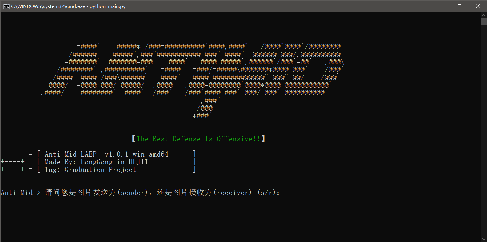

# Anti-Mid-LAEP
***【基于Logistic混沌序列与Arnold置乱的反中间人图像加密系统】***

## 功能概述
**主题：图像加密、反中间人、网络安全**  
Windows终端程序，请在DOS下运行。  
基于Logistic混沌序列与Arnold置乱两种像素加密算法的图像加密系统，同时附带反中间人功能，若加密的图像被中间人截获后，进行解密时系统会自动识别是否为发送方指定接收方，若不是则会告知服务器，服务器将中间人pc上包括ip、pc名、地理位置、操作系统、开发端口、运行进程等一系列数据整理成邮件发送到发送方指定的邮箱内。

## 运行前操作
安装第三方库：`pip install -r Library.txt`  
修改配置：  
服务器程序**Service/service.py**运行前务必修改同目录下的**message.ini**配置文件信息，其中包括数据库的相关信息和服务器端发送邮箱信息。
（服务器发送邮箱建议选用QQ邮箱和其token进行实验）

## 运行指南
**1、运行Service/token_service.py：**`python token_service.py`  
该代码运行后会在每日0时在数据库中生成token；亦可在main下调整注释代码，手动修改默认时间至当天0时，运行即可。  
**2、运行Service/service.py：**`python service.py`服务器程序，请保持运行。  
**3、运行程序主文件main.py：**`python main.py`  

